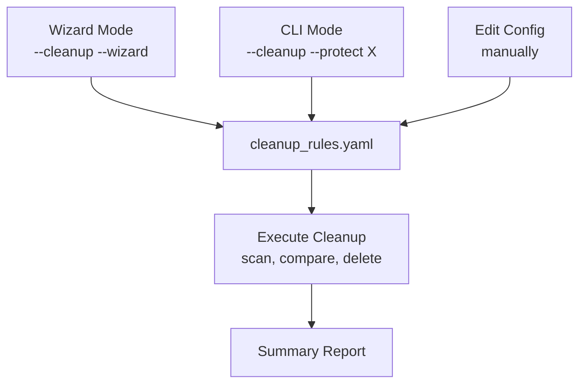

# MyCloud Data Recovery - Symlink Farm Approach

Recover your files from a failed WD MyCloud device using a symlink farm and rsync.

## Overview

When a WD MyCloud device fails, your data is stored on the internal drive in a non-obvious format:

- **Files** are stored with cryptic content-based names (e.g., `a22236cwsmelmd4on2qs2jdf`)
- **Metadata** (original filenames, folder structure) is stored in a SQLite database

This tool creates a **symlink farm** - a directory tree that mirrors your original folder structure using symbolic links that point to the actual files. You can then use standard tools like `rsync` to copy your files to any destination.

## Why This Approach?

| Feature | Symlink Farm + rsync | Direct Python Copy |
|---------|---------------------|-------------------|
| Memory usage | **~50MB** (streaming) | **6-11GB** (loads all metadata) |
| Speed | Fast (rsync is optimized) | Slower (Python overhead) |
| Resumability | Built into rsync | Custom logic needed |
| Verification | rsync --checksum | Manual |
| Network issues | rsync handles retries | Can hang/crash |
| Reliability | Very stable | Can OOM on large datasets |

## Quick Start

### Option 1: Full Restore with Monitoring (Recommended)

```bash
python rsync_restore.py \
    --db /mnt/backupdrive/restsdk/data/db/index.db \
    --source /mnt/backupdrive/restsdk/data/files \
    --dest /mnt/nfs-media \
    --farm /tmp/restore-farm
```

This single command will:

1. ✅ Run pre-flight checks (sizes, free space, system health)
2. 🔗 Create symlink farm (if not exists)
3. 📊 Show rsync progress every 60 seconds
4. 🔄 Retry failed files (3 attempts)
5. ✅ Verify with checksums
6. 📝 Log everything to `rsync_restore.log`

### Option 2: Interactive Wizard (New Users)

```bash
python rsync_restore.py --wizard
```

The wizard will guide you through:

1. 📁 Locating your database file (index.db)
2. 📂 Locating your source files directory
3. 💾 Choosing your destination directory
4. 🔗 Setting up the symlink farm directory
5. 🔧 Configuring options (sanitize pipes, checksums, dry-run)
6. ✅ Confirmation and execution

The wizard includes:

- **Path validation** - ensures directories exist before proceeding
- **Dry-run option** - preview what will be copied before committing
- **Automatic retry** - offers to run for real after successful dry-run

### Option 3: Symlink Farm Only (Advanced)

If you only need to create the symlink farm without rsync:

```bash
python create_symlink_farm.py --wizard
```

### Command Line

```bash
python create_symlink_farm.py \
    --db /mnt/backupdrive/restsdk/data/db/index.db \
    --source /mnt/backupdrive/restsdk/data/files \
    --farm /tmp/restore-farm
```

## Prerequisites

### 1. Mount Your Backup Drive

Connect the drive from your failed MyCloud device and mount it:

```bash
# Find the drive
lsblk

# Create mount point
sudo mkdir -p /mnt/backupdrive

# Mount (adjust device as needed)
sudo mount /dev/sdb4 /mnt/backupdrive
```

### 2. Verify Data Structure

Your mounted drive should have this structure:

```text
/mnt/backupdrive/
└── restsdk/
    └── data/
        ├── db/
        │   └── index.db      # SQLite database with metadata
        └── files/
            ├── 0/
            ├── 1/
            ├── a/
            ├── b/
            │   └── b4xk2m...  # Actual file data
            └── ...
```

### 3. (Optional) Mount NFS Destination

If copying to a NAS:

```bash
sudo mkdir -p /mnt/nfs-media
sudo mount -t nfs -o soft,timeo=30,retrans=3 192.168.1.100:/volume1/media /mnt/nfs-media
```

**Important:** Use `soft` mount to prevent system hangs if the NAS becomes unresponsive.

## Step-by-Step Guide

### Step 1: Create the Symlink Farm

Run the wizard or command-line tool to create the symlink farm:

```bash
# Interactive wizard
python create_symlink_farm.py

# Or command-line with dry-run first
python create_symlink_farm.py \
    --db /mnt/backupdrive/restsdk/data/db/index.db \
    --source /mnt/backupdrive/restsdk/data/files \
    --farm /tmp/restore-farm \
    --dry-run
```

The output will show:

- ✅ Number of symlinks to create
- 📁 Directories skipped
- ⚠️ Files with missing source data
- ❌ Any errors

### Step 2: Verify the Farm Structure

Check that the symlinks look correct:

```bash
# See sample of created structure
find /tmp/restore-farm -type l | head -20

# Check a specific symlink
ls -la /tmp/restore-farm/Photos/2024/vacation.jpg
```

### Step 3: Preview What Will Be Copied

Use rsync dry-run to see what would be copied:

```bash
rsync -avnL /tmp/restore-farm/ /mnt/nfs-media/
```

Flags explained:

- `-a` = archive mode (preserves permissions, times, etc.)
- `-v` = verbose
- `-n` = dry-run (don't actually copy)
- `-L` = follow symlinks (copy actual files, not links)

### Step 4: Copy Files

When ready, copy the files:

```bash
rsync -avL --progress /tmp/restore-farm/ /mnt/nfs-media/
```

For large transfers, consider using `screen` or `tmux`:

```bash
screen -S restore
rsync -avL --progress /tmp/restore-farm/ /mnt/nfs-media/
# Press Ctrl+A, D to detach
# Later: screen -r restore to reattach
```

### Step 5: Verify the Copy

Compare source and destination:

```bash
# Check for differences
rsync -avnL --checksum /tmp/restore-farm/ /mnt/nfs-media/

# Find files only in destination (potential duplicates from old runs)
rsync -avnL /mnt/nfs-media/ /tmp/restore-farm/ > extras.txt
```

## Common Scenarios

### Resume an Interrupted Copy

Just run rsync again - it will skip already-copied files:

```bash
rsync -avL --progress /tmp/restore-farm/ /mnt/nfs-media/
```

### Copy Only Specific Folders

```bash
rsync -avL --progress /tmp/restore-farm/Photos/ /mnt/nfs-media/Photos/
```

### Exclude Certain Files

```bash
rsync -avL --progress --exclude='*.tmp' --exclude='.DS_Store' \
    /tmp/restore-farm/ /mnt/nfs-media/
```

### Handle Pipe Characters in Filenames

Some filenames contain `|` which can cause issues on Windows/NTFS:

## Cleanup: Finding and Removing Orphaned Files

### What is an Orphan File?

An **orphan file** is a file that exists in your destination directory but does NOT have a corresponding entry in the MyCloud database. Orphans can occur from:

- **Buggy previous runs** - Earlier versions of restore scripts may have created duplicate files with incorrect paths
- **Interrupted copies** - Partial files from failed transfers
- **Manual additions** - Files you added directly to the destination (these should be protected, not deleted)

**Example:**

```text
Destination: /mnt/nfs-media/Photos/2024/
├── vacation.jpg          ← ✅ Matches DB entry, KEEP
├── vacation (1).jpg      ← ⚠️  ORPHAN - duplicate from bad run
├── IMG_001.jpg           ← ✅ Matches DB entry, KEEP
└── my-notes.txt          ← ⚠️  ORPHAN - but user-added, PROTECT
```

### Cleanup Workflow



### Usage Modes

**Mode 1: Interactive Wizard** (recommended for first-time cleanup)

```bash
python rsync_restore.py --cleanup --wizard
```

The wizard will:

1. Scan your destination directory
2. Show orphan counts per folder
3. Ask you to classify each folder (protect vs cleanup)
4. Save your choices to `cleanup_rules.yaml`
5. Delete orphans (with confirmation)

**Mode 2: CLI with Flags**

```bash
# Protect user folders, cleanup MyCloud folders
python rsync_restore.py --cleanup \
    --protect "my-personal-stuff/*" \
    --protect "Downloads/*" \
    --cleanup-folder "Photos/*" \
    --dry-run

# Run with saved config
python rsync_restore.py --cleanup --config ./cleanup_rules.yaml
```

**Mode 3: Edit Config Directly**

Create or edit `cleanup_rules.yaml`:

```yaml
version: 1
destination: /mnt/nfs-media

# Folders to NEVER delete from (user-added content)
protect:
  - "my-personal-stuff/*"
  - "Downloads/*"

# Folders to clean orphans from (MyCloud restored content)
cleanup:
  - "Photos/*"
  - "Videos/*"
  - "Music/*"
```

Then run:

```bash
python rsync_restore.py --cleanup --config ./cleanup_rules.yaml
```

### Cleanup Safety Features

- **Dry-run by default** - Always shows what would be deleted first
- **Protected folders** - User-added folders are never touched
- **Config file** - Your choices are saved and reusable
- **Confirmation required** - Must explicitly confirm before deletion

## Troubleshooting

### Handle Pipe Characters in Filenames (continued)

```bash
python create_symlink_farm.py --sanitize-pipes ...
```

### Verify with Checksums (Slower but Thorough)

```bash
rsync -avnL --checksum /tmp/restore-farm/ /mnt/nfs-media/
```

## Troubleshooting

### "Too many open files"

Increase file descriptor limits:

```bash
ulimit -n 65536
```

### NFS Mount Hangs

Use soft mount with timeouts:

```bash
sudo umount /mnt/nfs-media
sudo mount -t nfs -o soft,timeo=30,retrans=3 192.168.1.100:/volume1/media /mnt/nfs-media
```

### Symlinks Don't Work Across Filesystems

The farm directory must be on the same filesystem as the source files, OR you must use rsync with `-L` flag (which follows symlinks).

### "Permission denied" Errors

```bash
# Check source permissions
ls -la /mnt/backupdrive/restsdk/data/files/

# Run rsync with sudo if needed
sudo rsync -avL --progress /tmp/restore-farm/ /mnt/nfs-media/
```

### Database "locked" or "unable to open"

Make sure no other process is accessing the database:

```bash
fuser /mnt/backupdrive/restsdk/data/db/index.db
```

## Monitoring Long Transfers

Use the included monitor script to watch system health:

```bash
# Start monitor in background
./monitor.sh &

# Or run in separate terminal
./monitor.sh
```

The monitor tracks:

- Memory usage
- System load
- Open files
- NFS mount status
- Copy progress (if running restsdk_public.py)

## File Structure

```text
mycloud-restsdk-recovery-script/
├── rsync_restore.py         # Full restore with monitoring (RECOMMENDED)
├── create_symlink_farm.py   # Symlink farm creator (standalone)
├── monitor.sh               # System health monitor
├── restsdk_public.py        # Alternative: direct Python copy (high memory)
├── preflight.py             # Pre-flight system checks
├── tests/
│   └── test_symlink_farm.py # Unit tests
└── README-SYMLINK-FARM.md   # This file
```

## Command Reference

### rsync_restore.py (Recommended)

```text
Usage: rsync_restore.py [OPTIONS]

Required:
  --db PATH             Path to SQLite database (index.db)
  --source PATH         Source directory containing files
  --dest PATH           Destination directory
  --farm PATH           Symlink farm directory

Options:
  --preflight-only      Run checks only, don't copy
  --dry-run, -n         Preview what would be copied
  --no-checksum         Skip verification (faster, less safe)
  --retry-count N       Retries for failed files (default: 3)
  --log-interval N      Progress log interval in seconds (default: 60)
  --log-file PATH       Log file path (default: rsync_restore.log)
  --sanitize-pipes      Replace | with - in paths
  --skip-farm           Use existing farm, don't recreate
```

**Examples:**

```bash
# Full restore with all defaults (checksum ON, 3 retries, 60s logging)
python rsync_restore.py \
    --db /mnt/backupdrive/restsdk/data/db/index.db \
    --source /mnt/backupdrive/restsdk/data/files \
    --dest /mnt/nfs-media \
    --farm /tmp/restore-farm

# Dry run to preview
python rsync_restore.py --dry-run \
    --db index.db --source /files --dest /nfs --farm /tmp/farm

# Faster transfer (skip checksum verification)
python rsync_restore.py --no-checksum \
    --db index.db --source /files --dest /nfs --farm /tmp/farm

# Pre-flight checks only
python rsync_restore.py --preflight-only --source /files --dest /nfs
```

### create_symlink_farm.py

```text
Usage: create_symlink_farm.py [OPTIONS]

Options:
  --wizard, -w        Run interactive wizard (default if no args)
  --db PATH           Path to SQLite database (index.db)
  --source PATH       Source directory containing files
  --farm PATH         Output directory for symlink farm
  --sanitize-pipes    Replace | with - in filenames
  --dry-run, -n       Preview without creating symlinks
  --verbose, -v       Show detailed output
  --help, -h          Show help message
```

### Useful rsync Flags

| Flag | Description |
|------|-------------|
| `-a` | Archive mode (preserves everything) |
| `-v` | Verbose output |
| `-n` | Dry-run (preview only) |
| `-L` | Follow symlinks |
| `--progress` | Show transfer progress |
| `--checksum` | Verify with checksums (slower) |
| `--exclude` | Skip matching files |
| `--delete` | Remove extra files in destination |

## Database Schema

The SQLite database (`index.db`) contains file metadata:

```sql
SELECT id, parentID, contentID, name FROM Files LIMIT 5;
```

- `id` - Unique file/folder ID
- `parentID` - Parent folder ID (NULL for root)
- `contentID` - Hash-based filename in /files directory
- `name` - Original filename

## Contributing

Issues and pull requests welcome at:
<https://github.com/ericchapman80/mycloud-restsdk-recovery-script>

## License

MIT License - See LICENSE file for details.
